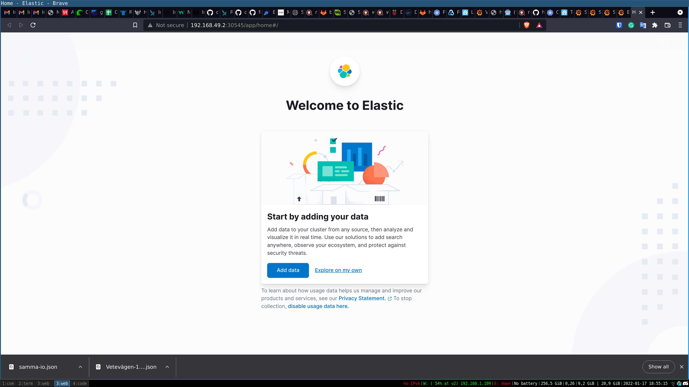
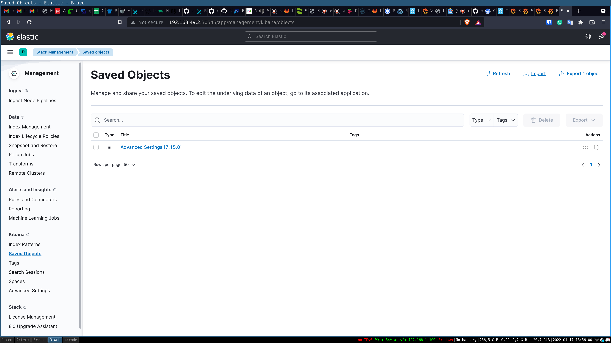

# Init everything 


In this step we will setup the tools we need to get started.
We will also deploy the scanner and se so that our basic setup is done and working 


### Install minikube
If you have not already done so install minkube and veridy your minikube is working.


https://minikube.sigs.k8s.io/docs/start/


## Deploy the Samma Operator and API


```
kubectl apply -f https://raw.githubusercontent.com/samma-io/operator/main/manifest/samma-operator.yaml
```

Verify thay are all running 

```
kubectl get all -n samma-io
```

NAME                                  READY   STATUS    RESTARTS   AGE
pod/samma-api-596d889f59-5vsh5        1/1     Running   0          2m57s
pod/samma-operator-6696dc4bcf-dr8c5   1/1     Running   0          2m57s

NAME          TYPE       CLUSTER-IP     EXTERNAL-IP   PORT(S)        AGE
service/api   NodePort   10.100.44.66   <none>        80:32153/TCP   2m57s

NAME                             READY   UP-TO-DATE   AVAILABLE   AGE
deployment.apps/samma-api        1/1     1            1           2m57s
deployment.apps/samma-operator   1/1     1            1           2m57s

NAME                                        DESIRED   CURRENT   READY   AGE
replicaset.apps/samma-api-596d889f59        1         1         1       2m57s
replicaset.apps/samma-operator-6696dc4bcf   1         1         1       2m57s
matte@hrb:~/projects/samma/guide$
```


## Deploy the samma tools
Wi will start with deploying the highground into our minikube cluster


```
kubectl apply -f https://raw.githubusercontent.com/samma-io/guide/main/1-init/1-deploy/highground.yaml
```


## Verify that the tools are working

```
kubectl get all -n samma-io
```
Should look something like this

```
matte@hrb:~/projects/samma/guide/1-init/1-deploy$ kubectl get pods -n samma-io
NAME                              READY   STATUS    RESTARTS      AGE
pod/elasticsearch-57c4b64bcd-j5wpc    1/1     Running   0          4m51s
pod/grafana-7dd7cd6475-9wp6j          1/1     Running   0          4m51s
pod/kibana-784b565464-7jx6w           1/1     Running   0          4m51s
pod/proxy-69b4dd8f75-n2grv            3/3     Running   0          4m51s
pod/samma-api-798f86f6d7-p8glj        1/1     Running   0          5m8s
pod/samma-operator-687df768d8-77c79   1/1     Running   0          5m8s

```

You should se our pods are in running state. If the Elasticsearch pod is not ready then wait some untill it is in running state


## Get access to dashbourds
Lets list all the service 

```
matte@hrb:~/projects/samma/guide$ kubectl get svc -n samma-io
NAME               TYPE        CLUSTER-IP       EXTERNAL-IP   PORT(S)          AGE
api             ClusterIP      10.104.124.70    <none>        8080/TCP                                       6m2s
elasticsearch   ClusterIP      10.99.79.149     <none>        9200/TCP                                       5m45s
grafana         ClusterIP      10.101.133.53    <none>        3000/TCP                                       5m45s
kibana          ClusterIP      10.98.232.148    <none>        5601/TCP                                       5m45s
samma           NodePort       10.100.70.199    <none>        5601:31145/TCP,3000:31803/TCP,8080:32023/TCP   5m45s
samma-lb        LoadBalancer   10.106.175.221   <pending>     5601:30895/TCP,3000:31486/TCP,8080:32482/TCP   5m45s
```


Open a connections to the samma service
```
 minikube service samma -n samma-io
```
This will open your browser and defult is the api 

verify in the port by looking at 5601:31145/TCP,3000:31803/TCP,8080:32023/TCP where 

5601:31145/TCP <--- kibana 
3000:31803/TCP <---- grafana    Login with samma / samma-io 
8080:32023/TCP <---api


## No persitant data
So have in mind this minikube and test has no data that will be saved. If the pods ore elasticsearch is killed all data will be gone.


### Setup Grafana
Grafana should already be setup and ready to use. 
Verify you can login and look at the samma dashbourd. Theer are now scanners running so there will be no resoult on the grafs.


```
minikube service samma -n samma-io


Then change the port to acceess grafana
```

## Check if the samma dashboard is loaded

```
Login with samma/samma-io 
```


## Samma API
Load the samma api by

```
minikube service samma -n samma-io


Then change the port to acceess the api
```

Verify you have access and can see the samma api page


### Setup Kibana

Kibana we need to add the dashbouard manuall

First open the gui
```
minikube service samma -n samma-io


Then change the port to acceess kibana
```

Then we can install our json that will setup the kibana dashbourds. They will make a error for we have not setup the index pattern but that will be resolved later when we start the scanner and they will send data to elastic







