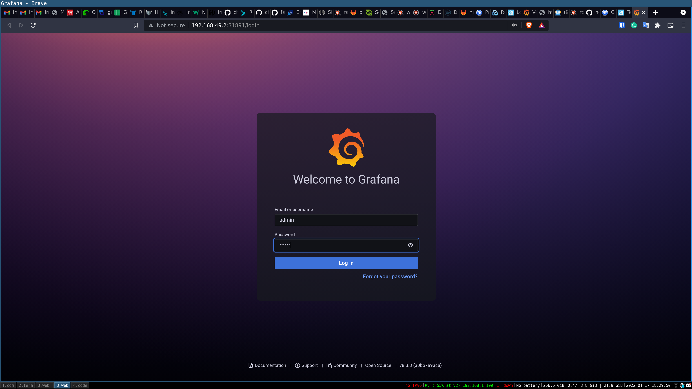
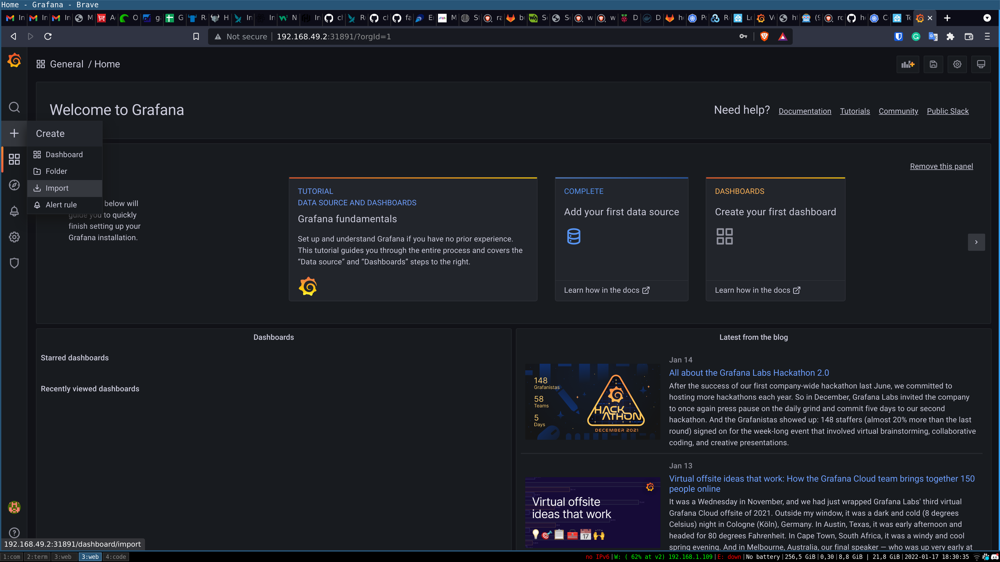
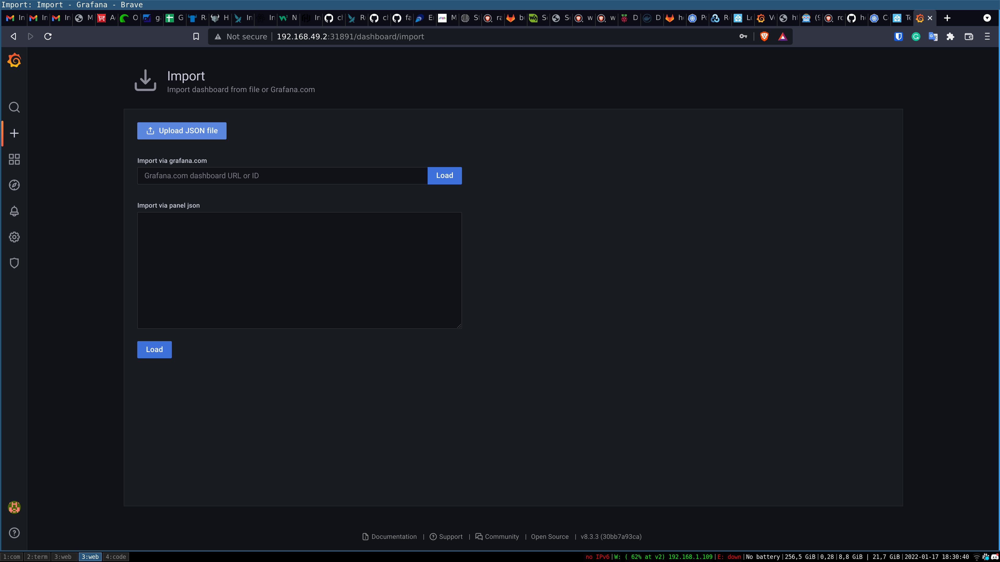
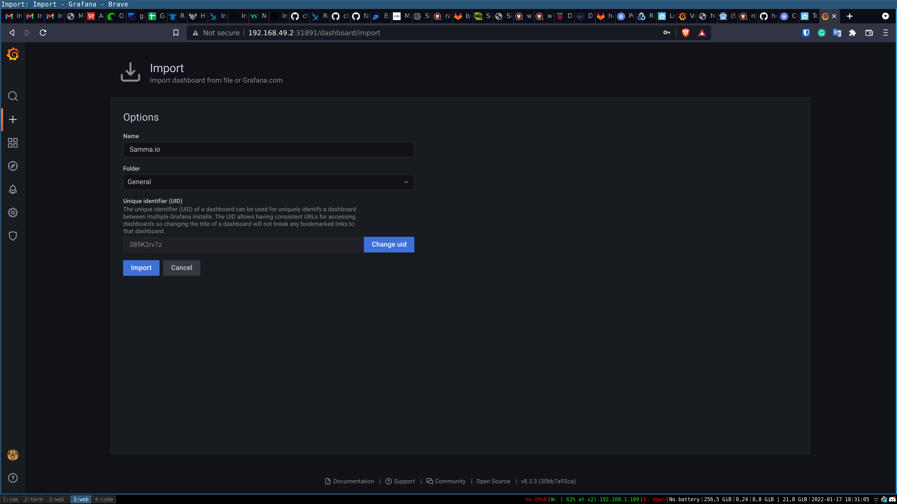

# Init everything 


In this step we will setup the tools we need to get started.
We will also deploy the scanner and se so that our basic setup is done and working 


### Install minikube
If you have not already done so install minkube and veridy your minikune is working.


https://minikube.sigs.k8s.io/docs/start/


## Deploy the samma tools
Wi will start with deploying the highground into our minikube cluster


```
kubectl create namespace samma-io
kubecte apply -f 1-deploy/highground.yaml
```


## Verigy that the tools are working

```
kubectl get pods -n samma-io
```
Should look something like this

```
matte@hrb:~/projects/samma/guide/1-init/1-deploy$ kubectl get pods -n samma-io
NAME                              READY   STATUS    RESTARTS      AGE
elasticsearch-549fd86dfd-4bj5m    1/1     Running   0             2m17s
grafana-654f5bc67d-xf278          1/1     Running   0             5m41s
kibana-784b565464-jjqdm           1/1     Running   0             5m41s
```

You should se our pods are in running state


## Get access to dashbourds
When the pods are running we can get accees to the diffrent dashbourds lets start with grafana


```
minikube service samma-io/grafana
```
This will open your browser and show the grafana. You can login with admin/admin and change the 

And to open the kibana dashbourd you type


```
minikube service samma-io/kibana
```


## No persitant data
So have in mind this minikube and test has no data that will be saved. If the pods ore elasticsearch is killed all data will be gone.


## Adding the samma-io Dashbourd
To make grafs easy samma.io has some base dashbourd that can be added. Today you need to login into the tools and add json file to setup the dashbourds.


### Setup Grafana

First open upp the grafana dashbourd

```
minikube service grafana-nodeport -n samma-io
```

Login with admin/admin 








Now you the samma dashbourd are loaded for grafanna !


### Setup Kibana